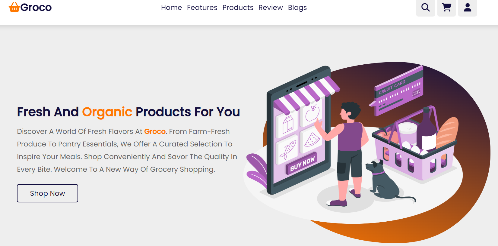

# Responsive Grocery Website Design



This repository contains the source code for a responsive grocery website design. The design is optimized for various screen sizes and devices, ensuring a seamless user experience.

## Table of Contents
- [Demo](#demo)
- [Features](#features)
- [Installation](#installation)

## Demo

You can view a live demo of this responsive grocery website design at [Demo Link](https://rg-rohit9431.github.io/responsive-grocery-website-design/).

## Features

- Responsive design for mobile, tablet, and desktop devices.
- User-friendly navigation for easy access to products.
- Product categories and search functionality.
- Shopping cart and checkout process.
- Modern and appealing user interface.

## Getting Started

You Only need to copy the demo link provide below and paste on browser

[https://rg-rohit9431.github.io/responsive-grocery-website-design/](https://rg-rohit9431.github.io/responsive-grocery-website-design/)

### Prerequisites

You'll need the following software/tools to run the project:

- Web browser (e.g., Google Chrome, Firefox)
- Code editor (e.g., Visual Studio Code)

### Installation

1. Clone the repository:

```bash
https://github.com/rg-rohit9431/responsive-grocery-website-design.git
